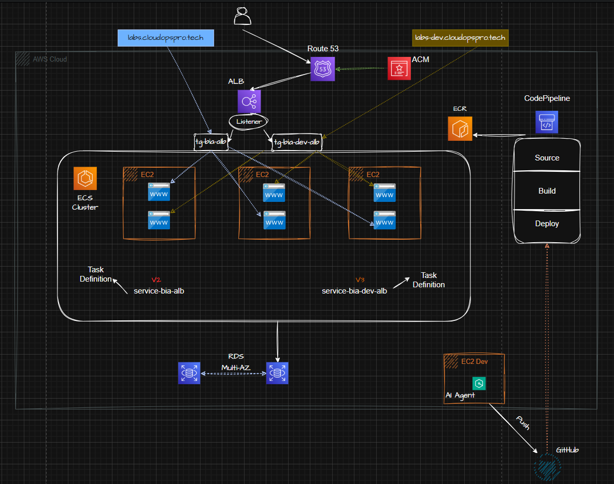

🚀 **Projeto AWS & IA – Ambiente em Nuvem com Deploy Automatizado**

Este projeto foi desenvolvido durante um evento sobre AWS & IA do professor Henrylle Maia, com foco na criação de ambientes em alta disponibilidade na nuvem da AWS, utilizando linguagem natural por meio do Amazon Q.

## 🏗️ Arquitetura da Solução
&nbsp;



### Componentes Principais:
- **Route 53 + ACM** → Gerenciamento de DNS e certificados SSL.  
- **ALB (Application Load Balancer)** → Distribuição de tráfego entre instâncias.  
- **ECS Cluster (EC2)** → Execução dos containers da aplicação.  
- **ECR** → Armazenamento das imagens Docker.  
- **RDS Multi-AZ** → Banco de dados relacional com alta disponibilidade.  
- **CodePipeline** → Automatização de build e deploy contínuo.  
- **GitHub** → Repositório de código integrado ao pipeline.  
- **AI Agent (EC2 Dev)** → Utilizado para auxiliar no desenvolvimento com suporte de IA.  


## 🤖 Integração com MCP Server

O ambiente conta com integração ao **MCP Server (Model Context Protocol)**, que atua como um **agente inteligente** conectado à infraestrutura.  

### Funcionalidades do MCP Server:
- Auxilia no gerenciamento e monitoramento da aplicação em execução.  
- Permite interações em linguagem natural com os recursos AWS.  
- Automatiza tarefas de administração e suporte à aplicação.  
- Facilita troubleshooting e otimiza o fluxo de desenvolvimento.  

Essa integração demonstra como IA + Cloud podem trabalhar em conjunto para aumentar a produtividade e reduzir esforços operacionais.


## ⚙️ Como Funciona o Deploy

Alterações são feitas no código da aplicação e enviadas para o GitHub.

O pipeline integrado detecta a alteração.

O build e deploy são realizados automaticamente na AWS.

A aplicação atualizada fica disponível no ambiente em alta disponibilidade.


📂 Estrutura do Repositório


├── src/                # Código-fonte da aplicação
├── buildspec.yml       # Instruções de build para o CodeBuild
├── Dockerfile          # (se aplicável) Imagem para execução da aplicação
├── README.md           # Documentação do projeto
├── deploy-ecs.sh       # Script CI/CD


✨ Aprendizados

Como utilizar Amazon Q para provisionar recursos AWS usando linguagem natural.

Boas práticas de alta disponibilidade na nuvem.

Integração de CI/CD com GitHub e AWS.


#### Para rodar as migrations no container ####
```
docker compose exec server bash -c 'npx sequelize db:migrate'
```

